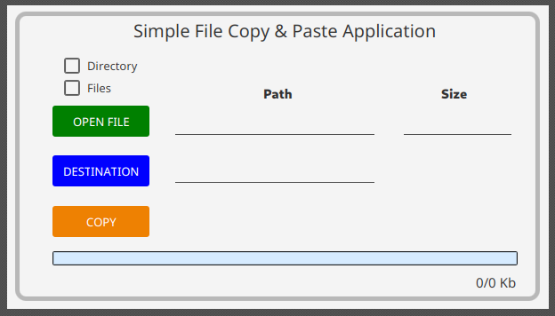
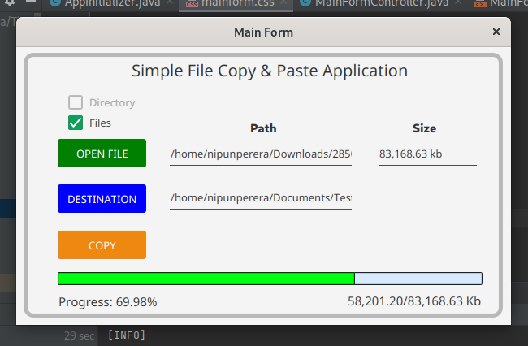

<!-- ABOUT THE PROJECT -->
# <b>Simple Copy & Paste Application</b>





<p>A simple copy & paste application created using Java and JavaFX in order to learn how the buffer works for file reading and writing.
<br>
Also we have slightly focused on using a separate thread for UI rendering and while keeping the main thread just for reading and writing task.
</p>


## Built with using

* Java 
* JavaFX 


## How to use this repository

* Open the terminal
* Then clone the repo using
```
git clone https://github.com/nipunsperera/simple-copy-app.git
```


<!-- CONTACT -->
## Contact

Nipun Perera - [@LinkedIn](https://www.linkedin.com/in/nipunperera96/)

Project Link: [Check the repository on GitHub](https://github.com/nipunsperera/simple-copy-app.git)


<!-- MARKDOWN LINKS & IMAGES -->
<!-- https://www.markdownguide.org/basic-syntax/#reference-style-links -->